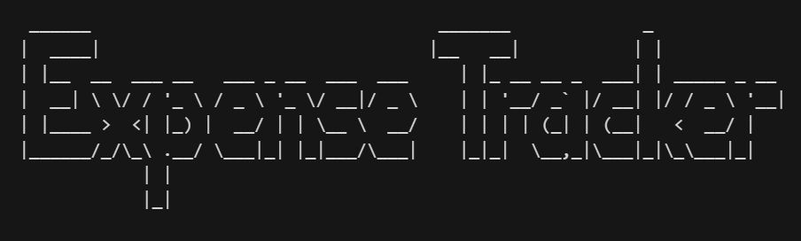

## Overview

This expense tracker termial application will allow you to document your spending, whether with
liquid assets such as debit or cash, or with credit.

The purpose for writing this software was so that I could better track my spending compared to my income
in order to build better financial habits and budget my money more wisely.

Link to YouTube demonstration:

[Expense Tracker - Demo](https://youtu.be/jgFlINb02KQ)

## Development Environment

I used the most recent release of the Java Development Kit (JDK-21).

Using some Windows batch files I am able to run the right commands in powershell to properly compile
all my java files (using the `javac` command) and then run my program main (using the `java` command).

compile.bat

```
javac -d ./build [source files]
```

run.bat

```
cd ./build
java [class file where main is]
```

---

Now I can just run

```
./compile; ./run
```

in the command line and it will automatically compile and run the full program.

## Useful Websites

Websites that helped with my Java syntax:

- [W3Schools - Java Tutorial](https://www.w3schools.com/java/)
- [Oracle - Java SE 8 API Specification](https://docs.oracle.com/javase/8/docs/api/overview-summary.html)

## Future Work

#### To Do

- Refactor methods for isights and tithing to be separate classes that inherit
  from an absctract base class method
- Refactor CSVInteractor class to have one method for reading all the data and
  returning a list of line data strings.

#### Features

- Better ascci art for the title banner
- On close, sort rows chronologically in csv file
- Somehow autoindicate month/year for insights/tithing
